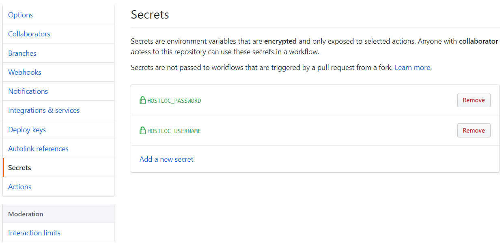
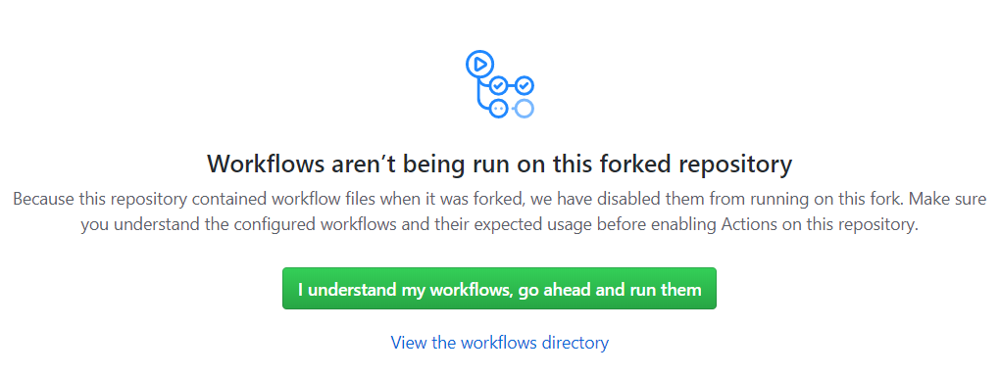

# Hostloc Auto Get Points
使用 GitHub Actions 自动获取 Hostloc 论坛积分

## 使用说明

Fork 本仓库，然后点击你的仓库右上角的 Settings，找到 Secrets 这一项，添加两个秘密环境变量。

其中 `HOSTLOC_USERNAME` 存放你在 Hostloc 的帐户名，`HOSTLOC_PASSWORD` 存放你的帐户密码。支持同时添加多个帐户，数据之间用半角逗号 `,` 隔开即可，帐户名和帐户密码需一一对应。

设置好环境变量后点击你的仓库上方的 Actions 选项，会打开一个如下的页面，点击 `I understand...` 按钮确认在 Fork 的仓库上启用 GitHub Actions 。

此时页面上会显示当前仓库所有的 Workflows，点击左侧的 `Hostloc Auto Get Points`，然后点击页面上黄色提醒框 `This scheduled workflow is disabled...` 处的 `Enable workflow` 按钮确认在 Fork 的仓库上启用 GitHub Actions 定时任务。  
最后在你这个 Fork 的仓库内随便改点什么（比如给 README 文件删掉或者增加几个字符）提交一下手动触发一次 GitHub Actions 就可以了。

